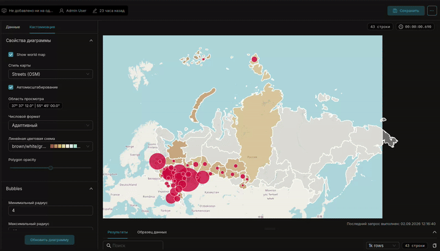
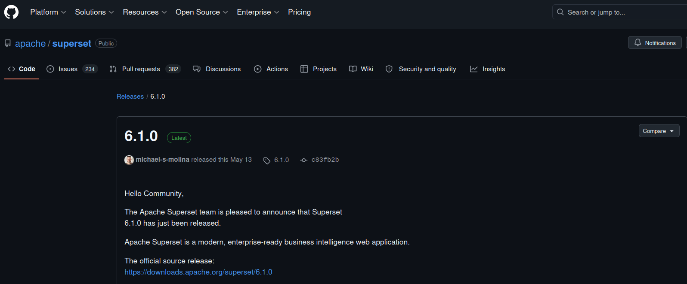

# Country Scatterplot Map — плагин графика Apache Superset
---

### 🇷🇺 Русский | [🇬🇧 English](README.md)

---

> **Кастомный плагин Apache Superset**, совмещающий **Country Map** (хороплет регионов)
> и **Scatter Plot** (пузырьки по координатам центров регионов).

---

## Возможности

- График дашборда (не Native Filter)
- Кросс-фильтры дашборда: клик по региону (или баблу) фильтрует другие чарты по **Entity**; повторный клик снимает фильтр. Выбранный регион — жирная обводка и zoom. Обратно: клик в таблице/другом чарте по любой колонке того же датасета (регион, макрорегион, …) — карта обводит и зумит все регионы, оставшиеся после фильтра
- Заливка регионов по метрике через **Linear Color Scheme** (как в Country Map)
- Пузырьки в центре региона: **автоматически** по ISO-коду из GeoJSON карты (как World Map), или опционально колонки **Longitude / Latitude** для своей позиции
- Размер пузырьков от **Метрики** с настройками **Minimum Radius**, **Maximum Radius**, **Multiplier**
- Цвет пузырьков: фиксированная палитра (white, crimson, blue, gold, …) или градиент как у регионов
- **Customize tooltips template** (Handlebars, как в Deck.gl Scatter)
- Переиспользует GeoJSON из `@superset-ui/legacy-plugin-chart-country-map`

---




## Требования

| Компонент | Версия |
|-----------|--------|
| Apache Superset | 6.1.0 |
| Python | 3.10+ |
| Node.js | 20+ (сборка образа: 22) |
| npm | 10+ |
| React (peer) | ^17.0.2 |
| npm-пакет | `@superset-ui/plugin-chart-country-scatterplot-map` |
| Ключ плагина | `chart_country_scatterplot_map` |

---

## Установка

### Шаг 1. Клонировать репозиторий Superset нужной версии
[](https://github.com/apache/superset/releases/tag/6.1.0)

```bash
git clone https://github.com/apache/superset.git -b 6.1.0;
```

### Шаг 2. Клонировать репозиторий плагина

```bash
git clone https://github.com/Kami-sama322/superset-plugin-chart-country-scatterplot-map.git;
```

### Шаг 3. Запустить скрипт автоустановки

```bash
chmod +x superset-plugin-chart-country-scatterplot-map/install.sh;
./superset-plugin-chart-country-scatterplot-map/install.sh ./superset;
```

> `./superset` — корень репозитория Superset из шага 1. Скрипт устанавливает плагин как **отдельный npm-пакет** в `superset-frontend/plugins/plugin-chart-country-scatterplot-map/` и регистрирует его в `setupPluginsExtra.ts` (`key: chart_country_scatterplot_map`).

#### Что делает скрипт:

| Действие | Файл |
|----------|------|
| 0. Копирует пакет плагина | `superset-frontend/plugins/plugin-chart-country-scatterplot-map/` |
| 1. Регистрирует плагин | `superset-frontend/src/setup/setupPluginsExtra.ts` |

> Path alias `@superset-ui/plugin-chart-*` уже покрывает этот пакет — отдельная запись в `tsconfig.json` не нужна.

---

### Шаг 4б. Ручная регистрация плагина (если install.sh не сработал)

#### 1. Скопировать пакет в каталог plugins

```bash
mkdir -p superset-frontend/plugins/plugin-chart-country-scatterplot-map/src
cp -r superset-plugin-chart-country-scatterplot-map/src/. superset-frontend/plugins/plugin-chart-country-scatterplot-map/src/
cp superset-plugin-chart-country-scatterplot-map/package.json superset-frontend/plugins/plugin-chart-country-scatterplot-map/package.json
cp superset-plugin-chart-country-scatterplot-map/tsconfig.json superset-frontend/plugins/plugin-chart-country-scatterplot-map/tsconfig.json
```

#### 2. Зарегистрировать в `superset-frontend/src/setup/setupPluginsExtra.ts`

```typescript
import CountryScatterplotMapChartPlugin from '@superset-ui/plugin-chart-country-scatterplot-map';

export default function setupPluginsExtra() {
  new CountryScatterplotMapChartPlugin()
    .configure({ key: 'chart_country_scatterplot_map' })
    .register();
}
```

Затем выполните `npm install` и `npm run dev-server`.

---

## Запуск Superset в режиме разработки

### Шаг 5. Python-окружение

```bash
cd superset
python -m venv .venv
source .venv/bin/activate
pip install -r requirements/development.txt
```

### Шаг 6. Конфигурация (Talisman / тайлы карты)

Скопируйте или сделайте symlink на `superset_config.py` из этого репозитория, либо укажите:

```bash
export SUPERSET_CONFIG_PATH=/path/to/superset-plugin-chart-country-scatterplot-map/superset_config.py
```

Чарт подгружает **растровые тайлы** подложки (OpenStreetMap, Carto, Mapbox API).
CSP Talisman должен разрешать их в `img-src` и `connect-src`.

При `DEBUG=True` Superset использует **`TALISMAN_DEV_CONFIG`**, а не
`TALISMAN_CONFIG` — пример конфига расширяет дефолты Superset и синхронизирует оба.

Опционально — стили Mapbox (`mapbox://styles/...` в **Map Style**) в `superset_config.py`:

```bash
MAPBOX_API_KEY="YOUR MAPBOX API KEY HERE"
```

Стили OSM / `tile://…` работают без токена.

### Шаги 7–10. База данных и администратор

```bash
superset db upgrade
superset fab create-admin \
  --username admin --firstname Admin --lastname User \
  --email admin@example.com --password admin
superset init
```

### Шаги 11–13. Backend и frontend

```bash
# терминал 1 — backend
superset run -h 0.0.0.0 -p 8088 --with-threads --reload --debugger

# терминал 2 — frontend (после install.sh + npm install в superset-frontend)
cd superset-frontend
npm install
npm run dev-server
```

---

## Быстрый старт через Docker

В репозитории есть автономный стенд: `Dockerfile` собирает Superset **6.1.0**
с уже встроенным плагином; `docker-compose.yml` монтирует `superset_config.py`
(CSP для тайлов карты) read-only.

**Нужно:** Docker, Docker Compose v2, ~8 GB RAM на сборку фронтенда. \
**Опционально:** raster-стили Mapbox в настройках чарта — в `superset_config.py` задайте `MAPBOX_API_KEY="YOUR MAPBOX API KEY HERE"`

```bash
git clone https://github.com/Kami-sama322/superset-plugin-chart-country-scatterplot-map.git
cd superset-plugin-chart-country-scatterplot-map

docker compose build    # первый раз: клон Superset 6.1.0 + npm run build (15–40 мин)
docker compose up -d    # init БД, admin/admin, load-examples при первом запуске
```

Открыть **http://localhost:8088** → вход **admin** / **admin**.

При первом запуске контейнер выполняет `superset db upgrade`, создаёт админа
и загружает примеры датасетов (1–3 мин). Повторные запуски пропускают init,
если том сохранён.

**Сброс окружения** (чистая БД и примеры):

```bash
docker compose down -v
docker compose up -d
```

**Проверка плагина:** Charts → + Chart → **Country Scatterplot Map**.

По умолчанию **Map Style** — OpenStreetMap, токен Mapbox не нужен.
Если видны полигоны, но нет подложки — смотрите блокировки CSP в devtools
и сверяйте с [`superset_config.py`](./superset_config.py).

---

## Как использовать чарт

1. **Charts → + Chart → Country Scatterplot Map**
2. Датасет с колонками:
   - **ISO 3166-2 Codes** (например `RU-MOW`, `RU-SPE`, `RU-SVE`)
   - **Metric** (число — цвет региона и размер пузырька)
   - *(опционально)* **Longitude** и **Latitude** — только если нужна своя позиция; иначе центры считаются из полигона региона
3. Выбрать **Country** (например Russia)
4. **Map Options**: Linear Color Scheme, формат чисел
5. **Bubbles**: Min/Max radius, Multiplier, режим цвета пузырьков
6. Опционально: **Tooltip contents** + **Customize tooltips template** (Handlebars)
7. **Map Style**: OSM, `tile://…`, или `mapbox://styles/{user}/{styleId}`

`mapbox://` стили грузятся как raster-тайлы Mapbox. Стиль должен быть
**public**, либо `MAPBOX_API_KEY` должен принадлежать владельцу стиля.
Токен другого аккаунта даёт 401 и «голые» полигоны.

### Пример структуры датасета

| iso_code | metric |
|----------|--------|
| RU-MOW | 1200 |
| RU-SPE | 980 |
| RU-SVE | 450 |

С опциональными своими центрами:

| iso_code | metric | lon | lat |
|----------|--------|-----|-----|
| RU-MOW | 1200 | 37.62 | 55.75 |

### Пример tooltip на Handlebars

```handlebars
<strong>{{region_name}}</strong><br/>
{{metric_formatted}}<br/>
{{longitude}}, {{latitude}}
```

---

## Структура пакета

```
superset-plugin-chart-country-scatterplot-map/
├── README.md
├── README.ru.md
├── src/
│   ├── index.ts
│   ├── CountryScatterplotMap.tsx
│   ├── mapData.ts              # enrich GeoJSON, пузырьки, color scale
│   ├── mapLayers.ts            # слои deck.gl
│   ├── useCountryGeoJson.ts    # хук загрузки GeoJSON
│   ├── useChartTooltip.tsx
│   ├── MapStatus.tsx
│   ├── buildQuery.ts
│   ├── controlPanel.ts
│   ├── transformProps.ts
│   ├── types.ts
│   ├── mapConfig.ts
│   ├── tooltipUtils.ts
│   ├── controls/
│   └── images/thumbnail.png
├── package.json
├── install.sh
├── Dockerfile                  # Superset 6.1.0 + production-сборка плагина
├── docker-compose.yml          # локальный demo-стенд
└── superset_config.py          # конфиг dev/Docker (Talisman + MAPBOX_API_KEY)
```

---

## Лицензия

Apache License 2.0 (как у Superset)
